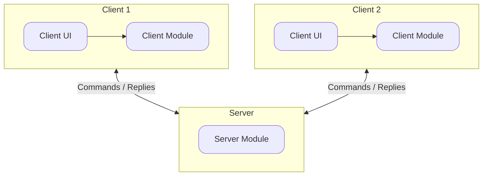
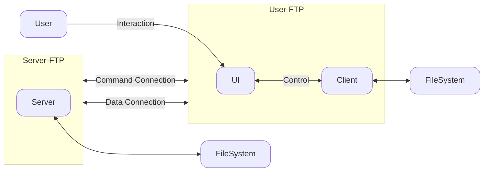
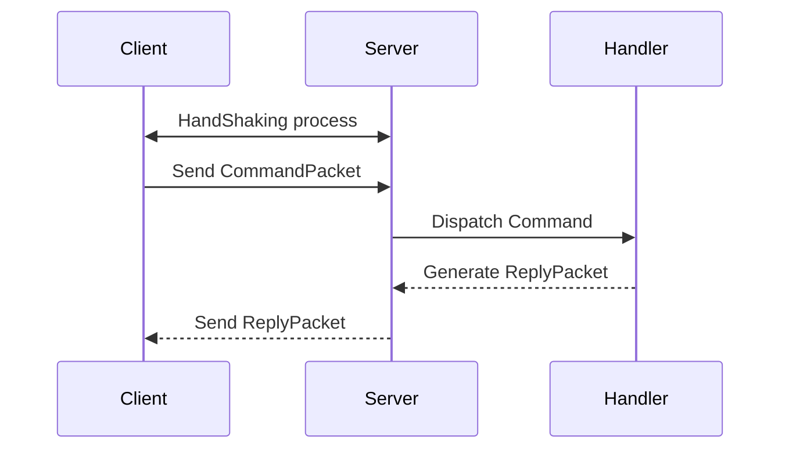

<!-- show a summary of what architecture the project follows -->
**FTP-WIRE** follows a modular <a href="https://en.wikipedia.org/wiki/Client%E2%80%93server_model" target="_blank">client-server architecture</a> which separates concerns between command processing, data transfer, and connection management.
The system is composed of two primary modules: a **Server** and a **Client** — which communicate using structured packet-based messages over TCP sockets.

## High Level Diagram <!-- show a simple overall project diagram -->

A Server Module is used to act as a central service for many clients. Each of those clients has a Client UI which could be different such as a CLI or a GUI application that integrates ftp-wire. 
Each client should be able to operate with the server separately, regardless of other clients errors or disconnections.
## The FTP Model
The Server/Client architecure follows the <a href="https://www.rfc-editor.org/rfc/rfc959" target="_blank">FTP-Model</a> design which is shown as follows 

## Project Structure
The Client Module is represented with the **Client** package, same for the Server Module.
Each of the two modules has many other submodules, each one is providing a specific functionality. There are many common submodules between the **Client** and the **Server** modules which are located in the **Common** package 

???+ wire-folder "ftp-wire"
    ??? wire-folder "Client"
        ??? wire-folder "Controllers"
            - `CommandController.java`  
            - `DataController.java`

        ??? wire-folder "Loggers"
            - `ClientLogger.java`

        ??? wire-folder "ReplyHandlers"
            - `FILE_INFO_ReplyHandler.java`  
            - `MESSAGE_ReplyHandler.java`  
            - `ReplyHandler.java`
            - `CWD_ReplyHandler.java`
            - `PWD_ReplyHandler.java`

        ??? wire-folder "Models"
            - `ClientConfig.java`  
            - `CommandSender.java`  
            - `ConnectionManager.java`  
            - `LoggerManager.java`  
            - `Reply.java`  
            - `ReplyPacketFactory.java`  
            - `ResponseReceiver.java`

        - `Client.java`

    ??? wire-folder "clientCLI"
        - `ClientCLI.java`  
        - `ClientCLILogger.java`
        - `CommandHandler.java`
        - `OfflineClientCLI.java`
        - `OfflineCommandType.java`

    ??? wire-folder "Common"
        ??? wire-folder "Exceptions"
            - `CommandFormatException.java`
            - `NoCommandWithSpecifiedHeaderException.java`
            - `RemoteDisconnectionException.java`
        ??? wire-folder "Loggers"
            - `Logger.java`
        ??? wire-folder "Models"
            - `Command.java`  
            - `Status.java`
            - `UtilityFunctions.java`
        ??? wire-folder "Packets"
            ??? wire-folder "Communication"
                - `CommandPacket.java`  
                - `ReplyPacket.java`
            ??? wire-folder "HandShaking"
                - `DonePacket.java`  
                - `HelloPacket.java`  
                - `PairPacket.java`  
                - `WelcomePacket.java`
            ??? wire-folder "IO"
                - `PacketReader.java`  
                - `PacketWriter.java`  
            - `Packet.java`
        ??? wire-folder "Serialization"
            - `PacketSerializer.java`
        ??? wire-folder "Types"
            - `PacketType.java`  
            - `ReplyType.java`

    ??? wire-folder "Server"
        ??? wire-folder "Exceptions"
            - `CanNotReadPacketException.java`  
        ??? wire-folder "Handlers"
            - `ChangeWorkingDirectoryHandler.java`
            - `CommandErrorHandler.java`  
            - `CommandHandler.java`  
            - `ErrorHandler.java`  
            - `HelpCommandHandler.java`  
            - `ListFilesCommandHandler.java`
            - `PrintWorkingDirectoryHandler.java`
            - `QuitCommandHandler.java`  
            - `RetrieveFileCommandHandler.java`
        ??? wire-folder "HandShaking"
            - `HandShakeManager.java`  
            - `Session.java`
        ??? wire-folder "Loggers"
            - `ServerCLILogger.java`  
            - `ServerLogger.java`
        ??? wire-folder "Models"
            ??? wire-folder "Types"
                - `CommandType.java`  
                - `ErrorType.java`
            - `ClientProfile.java`  
            - `CommandSelectorDispatcher.java`  
            - `ServerConfig.java`
            - `TaskDispatcher.java`  
            - `ThreadPool.java`
            - `UserConnection.java`  
        ??? wire-folder "Registeries"
            - `SessionRegistry.java`
        ??? wire-folder "SocketAcceptors"
            - `CommandSocketAcceptor.java`  
            - `DataSocketAcceptor.java`
        ??? wire-folder "Tasks"
            - `CommandTask.java`  
            - `DataTask.java`  
            - `SendFileTask.java`  
            - `SendPacketTask.java`  
            - `Task.java`
        - `Server.java`

    ??? wire-folder "Run"
        - `Client_CLI.java`  
        - `Server_CLI.java`

## Data/Connection flow
<!-- show how data moves through your system -->
The Client first will do a handshaking process which will identify his connection info and username then if the client connection success (for now there is no login functionality), he can send a command to the server then the server will schedule a task to serve that command. After the task is completed, the server schedule another task for sending a reply packet to the client which will identify the success or failure of the sent command. this also could be followed by sending a file from the server to the client through the Data Connection.

